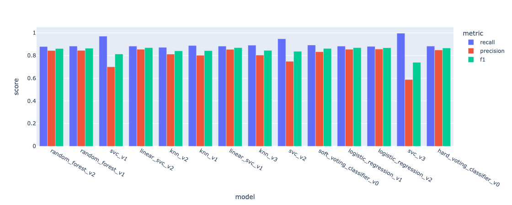

# 🧠 Mental Health ML

This project explores and models mental health trends among students using the Student Depression Dataset. The goal is to identify key lifestyle, academic, and personal factors contributing to student depression risk, and to build an interpretable machine learning model that can predict and explain those risks.

This project is part of a personal initiative to build meaningful, end-to-end machine learning applications through iterative development sprints. The focus is not only on building a predictive model but also on robust engineering practices, including creating reusable preprocessing pipelines and understanding the trade-offs between different modeling strategies.

## 🚀 Key Objectives
* Clean and preprocess a diverse dataset of categorical, numerical, and geographical data.
* Explore correlations between student lifestyle factors and depression symptoms through EDA.
* Build and evaluate a suite of classification models, from linear baselines to non-linear ensembles.
* Develop a custom model selection strategy in `GridSearchCV` to prioritize high recall without catastrophically impacting precision.
* Engineer robust, reusable Scikit-learn pipelines and custom transformers for a reproducible workflow.

## 🛠 Tech Stack
* **Core Libraries:** Python, Pandas, Scikit-learn, NumPy
* **Visualization:** Matplotlib, Seaborn, Plotly
* **Experimentation:** Jupyter Notebook
* **Model Persistence:** Joblib

## Notebooks
- [00_data_access.ipynb](./notebooks/00_data_access.ipynb) - Formats Geo Names data from `geonames.org` and saves it to CSV.
- [01_data_exploration.ipynb](./notebooks/01_data_exploration.ipynb) - Performs initial data exploration, cleaning, EDA, feature engineering, and train/test split.
- [02_data_preparation.ipynb](./notebooks/02_data_preparation.ipynb) - Preprocesses categorical and numerical data, creating scikit-learn pipelines for cleaning and transformation.
- [03_0_training_evaluation.ipynb](./notebooks/03_0_training_evaluation.ipynb) - Creates baseline models and explores preprocessed features for correlation.
- [03_1_logistic_regression.ipynb](./notebooks/03_1_logistic_regression.ipynb) - Trains and tunes a Logistic Regression model.
- [03_2_linear_svc.ipynb](./notebooks/03_2_linear_svc.ipynb) - Trains and tunes a Linear SVC model.
- [03_3_random_forest.ipynb](./notebooks/03_3_random_forest.ipynb) - Trains and tunes a Random Forest Classifier model.
- [03_4_svc.ipynb](./notebooks/03_4_svc.ipynb) - Trains and tunes an SVC model, focusing on non-linear kernels.
- [03_5_knn.ipynb](./notebooks/03_5_knn.ipynb) - Trains and tunes a K-Nearest Neighbors (KNN) model.
- [03_6_stacking_classifier.ipynb](./notebooks/03_6_stacking_classifier.ipynb) - Explores StackingClassifier and pivots to VotingClassifier for model ensembling.
- [04_test_prediction.ipynb](./notebooks/04_test_prediction.ipynb) - Evaluates trained models against the test dataset and visualizes performance.
- [05_huggingface_integration.ipynb](./notebooks/05_huggingface_integration.ipynb) - Integrates with Hugging Face Hub to upload/download datasets and models.
- [06_scratch_pad.ipynb](./notebooks/06_scratch_pad.ipynb) - A space for quick code experiments and API testing.

## Datasets
Data Provenance & Acknowledgments
The dataset used for this project was sourced from the [Student Depression Dataset](https://www.kaggle.com/datasets/adilshamim8/student-depression-dataset) on Kaggle, uploaded by user Adil Shamim.

> Note: While this Kaggle dataset was used as the basis for the analysis, efforts to locate the original primary source or an accompanying research paper were unsuccessful. As a result, specific details regarding the data collection methodology, survey design, and population demographics are not available within this project. The analysis and conclusions are therefore based solely on the data as provided on Kaggle.

### Other Datasets Used
[India Cities Database | Simplemaps.com](https://simplemaps.com/data/in-cities)

[World Cities Database](https://simplemaps.com/data/world-cities)

[GeoNames](https://download.geonames.org/export/dump/)

## 📁 Folder Structure

```
mental_health_ml/
│
├── .env
├── .git/
├── .gitignore
├── data/                 # Raw dataset and processed CSVs
├── models/               # Trained machine learning models
├── notebooks/            # Jupyter notebooks for EDA, modeling, etc.
├── requirements.txt      # Project dependencies
├── requirements_pc.txt   # Project dependencies for personal computer
├── src/                  # Source code for utility functions and modules
├── venv/                 # Virtual environment files
├── visualizations/       # Saved visualizations and plots
└── README.md             # This file
```

---

## 📈 Workflow & Methodology

This project followed a systematic, iterative approach to ensure robust and reproducible results.

1.  **Data Exploration & Cleaning:** Initial analysis focused on understanding data types, distributions, and identifying missing values or inconsistencies.
2.  **Pipeline Engineering:** A modular preprocessing pipeline was constructed using Scikit-learn's `Pipeline` and `ColumnTransformer`. Custom transformers were built to handle specific logic for cleaning, encoding, and feature engineering (e.g., `ClusterSimilarityTransformer`, `MapCityDepressionRatio`).
3.  **Baseline Modeling:** Simple linear models (Logistic Regression, Linear SVC) were trained to establish a baseline performance and test the hypothesis of linear separability in the data.
4.  **Advanced Modeling:** A diverse suite of models was trained and tuned, including tree-based ensembles (Random Forest), distance-based models (KNN), and kernel-based models (SVC), to capture potential non-linear patterns.
5.  **Custom Model Selection:** A custom `refit` strategy was implemented for `GridSearchCV` to select the best model based on a nuanced business objective: maximizing **Recall** while maintaining a reasonable **Precision**.
6.  **Ensembling:** A `VotingClassifier` was trained by combining the strengths of the best-performing diverse models to create a final, robust ensemble.
7.  **Final Evaluation:** All candidate models were evaluated on a hold-out test set to provide an unbiased estimate of their real-world performance.

---

## 📊 Sample Insights & Results

### EDA Insights
Correlation analysis revealed several intuitive factors associated with depression risk.
* **Positive Correlation:** Features such as `suicidal_thoughts`, high `academic_pressure`, `financial_stress`, and `unhealthy_dietary_habits` were positively correlated with depression.
* **Negative Correlation:** Conversely, `healthy_dietary_habits`, high `study_satisfaction`, and strong `social_support` showed a negative correlation, suggesting a potential protective effect.

### Model Performance on Test Data


* The final models presented a clear trade-off between maximizing recall (not missing at-risk students) and precision (reducing false alarms). 
* While linear models provided the best balance (highest F1-score), a non-linear SVC achieved near-perfect recall, presenting a strategic choice based on project goals.

| Model | Recall | Precision | F1-Score |
| :--- | :--- | :--- | :--- |
| **Linear SVC v2** | 0.883 | 0.855 | **0.869** |
| **Logistic Regression v2** | 0.880 | 0.857 | **0.868** |
| **Soft Voting Classifier v0**| 0.892 | 0.833 | 0.862 |
| **SVC v2 (Non-linear)** | **0.948** | 0.748 | 0.836 |
| **SVC v3 (Non-linear)** | **0.996** | 0.588 | 0.740 |

---

## 📌 Key Learnings & Achievements

* **Iterative Development vs. Perfection Paralysis:** A key lesson was the importance of rapid prototyping with baseline models before investing heavily in engineering complex pipelines. This project reinforced an iterative workflow: **validate ideas quickly, then build robust pipelines for what works.**
* **Debugging Complex Scikit-learn Pipelines:** Successfully diagnosed and resolved a subtle but critical bug related to **Pandas index misalignment** within custom transformers during cross-validation. The fix involved ensuring consistent index propagation when creating new feature DataFrames from NumPy arrays inside a transformer, a crucial lesson for creating reliable pipelines.
* **Advanced Model Selection Strategy:** Moved beyond single-metric optimization by implementing a **custom callable `refit` strategy in `GridSearchCV`**. This allowed for a nuanced model selection that prioritized high recall while using F1-score as a tie-breaker, directly aligning the model's performance with the project's real-world objectives.
* **Strategic Ensembling:** Deliberately constructed an ensemble (`VotingClassifier`) by selecting diverse base models (linear, tree-based, kernel-based) to leverage their different strengths, rather than simply combining the top-performing models.

## 🚀 Future Enhancements
* **Improve Ensemble:** Experiment further by training a "precision-specialist" model and adding it to the `VotingClassifier` to potentially improve the balance.
* **Feature Explainability:** Implement a SHAP-based analysis to understand not just feature *importance*, but also the *impact* and *interaction* of key features on model predictions for individual students.
* **Deployment:** Package the final model and preprocessing pipeline into a simple API (e.g., using FastAPI) and deploy it as an interactive web app for live predictions.
* **Deeper Analysis:** Explore clustering algorithms to identify distinct student profiles or risk groups based on their features.